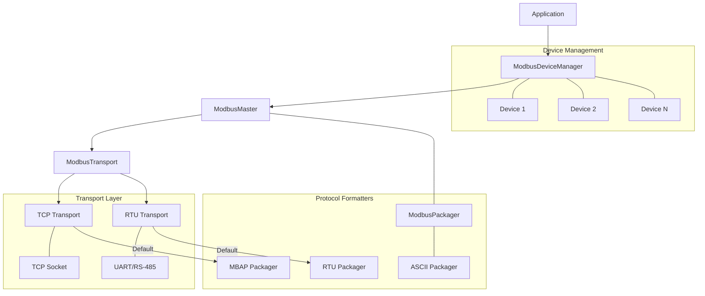
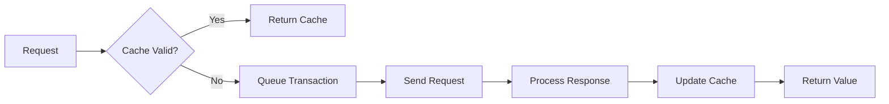

# Speed Framework Modbus Library

A comprehensive Modbus implementation for ESP32, supporting both TCP and RTU modes with advanced features like automatic polling, value caching, device management, and flexible packager system.

## Architecture



## Features

- **Multiple Transport Modes**
  - Modbus TCP with automatic reconnection
  - Modbus RTU over UART/RS-485
  - Configurable timing parameters

- **Flexible Protocol Formats**
  - MBAP (Modbus TCP) format
  - RTU (binary with CRC) format
  - ASCII (text with LRC) format
  - Each transport provides its appropriate default packager
  - Mix and match transports with custom packagers if needed

- **Device Management**
  - Automatic device discovery
  - Multiple device support
  - Configurable polling
  - Value caching

- **Advanced Features**
  - Transaction queueing
  - Automatic retries
  - Error handling
  - Statistics tracking

## Quick Start

```cpp
// Create TCP transport
auto transport = std::make_shared<ModbusTcpTransport>("192.168.1.100", 502);

// Configure master (uses transport's default packager)
ModbusConfig config;
config.responseTimeoutMs = 2000;
config.queueSize = 32;
auto master = std::make_shared<ModbusMaster>(transport, config);

// Create device manager
ModbusDeviceManager deviceManager(master);

// Add device and configure polling
auto device = deviceManager.addDevice(1, "Temperature Sensor");
device->enablePolling(0x0100, 1000, [](const ModbusValue& value) {
    if (value.valid) {
        printf("Temperature: %.1f°C\n", value.value / 10.0f);
    }
});
```

## Documentation Structure

- [Basic Usage](basic_usage.md) - Getting started guide
- [TCP Mode](tcp_mode.md) - TCP-specific features and configurations
- [RTU Mode](rtu_mode.md) - RTU/Serial communication details
- [Device Management](device_management.md) - Working with multiple devices
- [Packager System](packager_system.md) - Flexible protocol formatting
- [Advanced Features](advanced_features.md) - Caching, polling, and more

## Examples

- [Simple Master](../examples/modbus-master/modbus_master_example.cpp)
- [Packager Example](../examples/modbus-master/modbus_packager_example.cpp)
- [SRNE Solar Controller Client](../examples/srne-modbus/modbus_client.cpp)

## Performance



## Error Handling

The library provides comprehensive error handling:

- Transport-level errors (connection, timeout)
- Protocol-level errors (CRC, invalid responses)
- Device-level errors (exceptions)
- Queue management (overflow, timeout)

## Best Practices

1. **Transport Selection**
   - Use TCP for network-connected devices
   - Use RTU for direct serial connections
   - Consider latency requirements

2. **Packager Selection**
   - Let transports provide their default packagers for standard usage
   - Override with custom packagers only for special requirements
   - Choose appropriate packager for your device's protocol

3. **Performance Optimization**
   - Enable value caching for frequently read values
   - Use batch operations for multiple registers
   - Configure appropriate timeout values

4. **Error Handling**
   - Implement retry logic for unreliable networks
   - Monitor device connection status
   - Log and handle device exceptions

5. **Resource Management**
   - Configure appropriate queue sizes
   - Monitor memory usage
   - Clean up resources properly

## Contributing

See [CONTRIBUTING.md](../CONTRIBUTING.md) for guidelines on contributing to this project.

## License

This project is licensed under the MIT License - see the [LICENSE](../LICENSE) file for details.