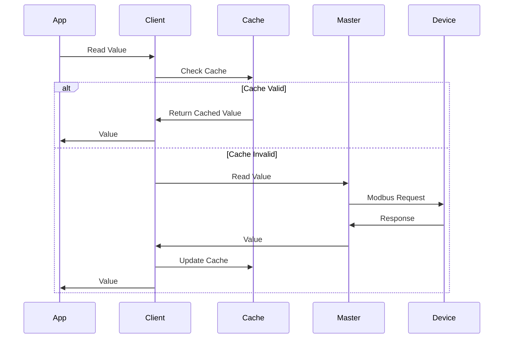
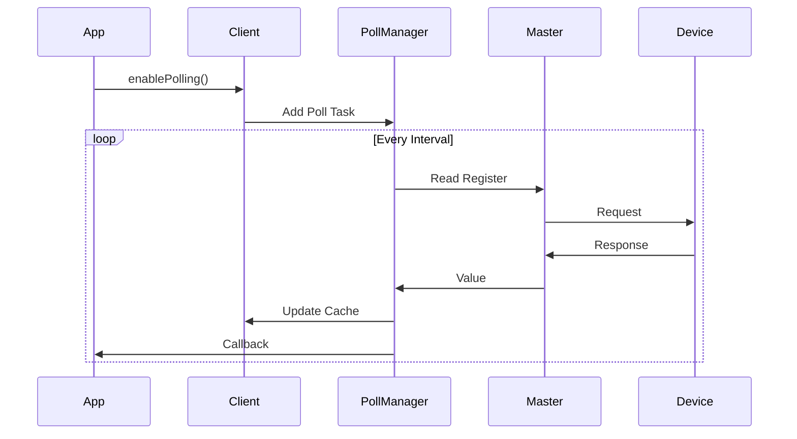
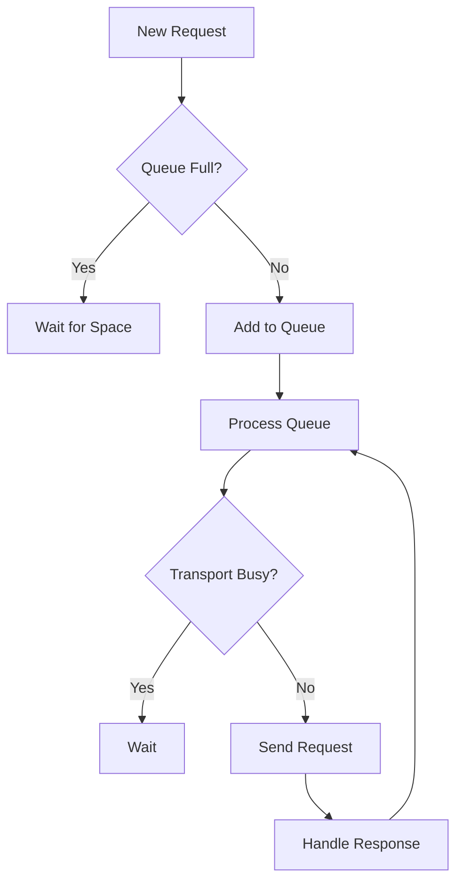

# Advanced Features

## Value Caching

The ModbusClient provides built-in value caching to reduce network traffic and improve response times.



### Cache Configuration

```cpp
// Set cache timeout per device
device->setMaxCacheAge(5000);  // 5 second cache timeout

// Set cache timeout per register
device->setCacheAge(0x0100, 1000);  // 1 second for specific register
```

### Reading with Cache

```cpp
// Read using cache
device->readHoldingRegisterCached(0x0100, [](const ModbusValue& value) {
    if (value.valid) {
        ESP_LOGI(TAG, "Value: %d (age: %dms)", 
                 value.value,
                 (xTaskGetTickCount() - value.timestamp) * portTICK_PERIOD_MS);
    }
});

// Force fresh read
device->readHoldingRegister(0x0100, [](const ModbusValue& value) {
    // Always reads from device
});
```

## Automatic Polling

The ModbusClient supports automatic polling of registers with configurable intervals.



### Polling Configuration

```cpp
// Enable polling with callback
device->enablePolling(0x0100, 1000, [](const ModbusValue& value) {
    if (value.valid) {
        ESP_LOGI(TAG, "Poll update: Register 0x%04X = %d", 
                 value.address, value.value);
    }
});

// Change polling interval
device->setPollInterval(0x0100, 2000);  // Change to 2 seconds

// Disable polling
device->disablePolling(0x0100);
```

### Multiple Register Polling

```cpp
// Poll multiple registers together
std::vector<uint16_t> registers = {0x0100, 0x0101, 0x0102};
device->enableMultiplePolling(registers, 1000,
    [](const std::vector<ModbusValue>& values) {
        for (const auto& value : values) {
            if (value.valid) {
                ESP_LOGI(TAG, "Register 0x%04X = %d", 
                         value.address, value.value);
            }
        }
    });
```

## Batch Operations

### Reading Multiple Registers

```cpp
// Read a block of registers
device->readMultipleHoldingRegisters(0x0100, 10,
    [](const std::vector<ModbusValue>& values) {
        ESP_LOGI(TAG, "Read %d registers:", values.size());
        for (const auto& value : values) {
            ESP_LOGI(TAG, "  Register 0x%04X = %d", 
                     value.address, value.value);
        }
    });

// Read specific registers
std::vector<uint16_t> addresses = {0x0100, 0x0200, 0x0300};
device->readHoldingRegisters(addresses,
    [](const std::vector<ModbusValue>& values) {
        // Process values
    });
```

### Writing Multiple Registers

```cpp
// Write block of registers
std::vector<uint16_t> values = {1, 2, 3, 4, 5};
device->writeMultipleHoldingRegisters(0x0100, values,
    [](bool success) {
        if (success) {
            ESP_LOGI(TAG, "Batch write successful");
        }
    });

// Write specific registers
std::map<uint16_t, uint16_t> registerValues = {
    {0x0100, 42},
    {0x0200, 123},
    {0x0300, 456}
};
device->writeHoldingRegisters(registerValues,
    [](bool success) {
        // Handle result
    });
```

## Transaction Queueing

The library supports automatic queueing of transactions for optimal performance.



### Queue Configuration

```cpp
// Configure queue size
ModbusConfig config;
config.queueSize = 32;          // Number of pending transactions
config.queueTimeoutMs = 1000;   // Queue timeout

auto master = std::make_shared<ModbusMaster>(transport, config);
```

### Priority Transactions

```cpp
// High priority write (jumps queue)
device->writeSingleRegisterPriority(0x0100, 42,
    [](const ModbusValue& value) {
        // Processed before normal transactions
    });
```

## Event Handling

### Value Change Events

```cpp
// Monitor value changes
device->onValueChange(0x0100, [](const ModbusValue& oldValue,
                                const ModbusValue& newValue) {
    ESP_LOGI(TAG, "Value changed: %d -> %d",
             oldValue.value, newValue.value);
});

// Monitor with threshold
device->onValueChange(0x0100, [](const ModbusValue& oldValue,
                                const ModbusValue& newValue) {
    // Only called if change > 10
}, 10);
```

### Connection Events

```cpp
// Monitor device connection status
device->onConnectionChange([](bool connected) {
    ESP_LOGI(TAG, "Device %s",
             connected ? "connected" : "disconnected");
});
```

## Data Transformation

### Value Scaling

```cpp
// Configure value scaling
device->setValueScaling(0x0100, 0.1f);  // Multiply by 0.1
device->setValueScaling(0x0101, 0.01f); // Multiply by 0.01

// Read scaled value
device->readHoldingRegisterScaled(0x0100,
    [](float value) {
        ESP_LOGI(TAG, "Scaled value: %.2f", value);
    });
```

### Data Type Conversion

```cpp
// Read as different types
device->readHoldingRegisterFloat(0x0100,   // 2 registers as float
    [](float value) {
        ESP_LOGI(TAG, "Float value: %.2f", value);
    });

device->readHoldingRegisterInt32(0x0100,   // 2 registers as int32
    [](int32_t value) {
        ESP_LOGI(TAG, "Int32 value: %d", value);
    });
```