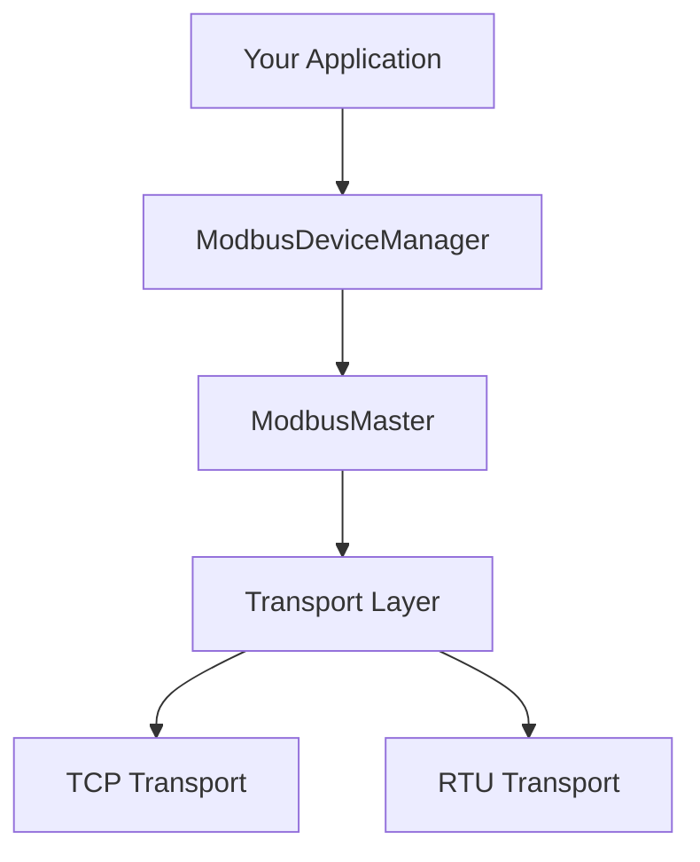
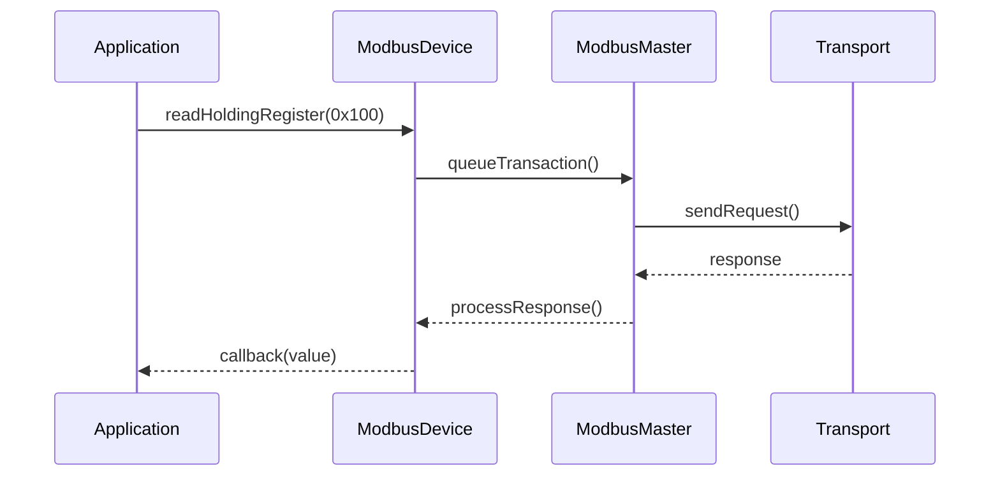

# Basic Usage Guide

This guide covers the fundamental concepts and basic usage of the Speed Framework Modbus library.

## Architecture Overview



## Basic Setup

### 1. Choose Transport Type

```cpp
// For TCP
auto transport = std::make_shared<ModbusTcpTransport>("192.168.1.100", 502);

// For RTU
auto transport = std::make_shared<ModbusUartTransport>(
    UART_NUM_1,    // UART port
    GPIO_NUM_17,   // TX pin
    GPIO_NUM_16,   // RX pin
    GPIO_NUM_4,    // RTS pin for RS485
    9600          // Baud rate
);
```

### 2. Configure Master

```cpp
ModbusConfig config;
config.responseTimeoutMs = 2000;  // Response timeout
config.queueSize = 32;           // Transaction queue size
config.taskPriority = 5;         // FreeRTOS task priority

auto master = std::make_shared<ModbusMaster>(transport, config);
if (!master->begin()) {
    ESP_LOGE(TAG, "Failed to start Modbus master");
    return;
}
```

### 3. Create Device Manager

```cpp
auto deviceManager = std::make_shared<ModbusDeviceManager>(master);
```

### 4. Add Devices

```cpp
auto device = deviceManager->addDevice(1, "Temperature Sensor");
```

## Basic Operations

### Reading Values

```cpp
// Read single holding register
device->readHoldingRegister(0x0100, [](const ModbusValue& value) {
    if (value.valid) {
        printf("Value: %d\n", value.value);
    }
});

// Read multiple registers
device->readMultipleHoldingRegisters(0x0100, 2, 
    [](const std::vector<ModbusValue>& values) {
        for (const auto& value : values) {
            if (value.valid) {
                printf("Value: %d\n", value.value);
            }
        }
    });
```

### Writing Values

```cpp
// Write single register
device->writeSingleRegister(0x0100, 42, [](const ModbusValue& value) {
    if (value.valid) {
        printf("Write successful\n");
    }
});

// Write multiple registers
std::vector<uint16_t> values = {42, 43, 44};
device->writeMultipleRegisters(0x0100, values, [](bool success) {
    if (success) {
        printf("Multiple write successful\n");
    }
});
```

### Setting Up Automatic Polling

```cpp
// Poll register 0x0100 every 1000ms
device->enablePolling(0x0100, 1000, [](const ModbusValue& value) {
    if (value.valid) {
        printf("Polled value: %d\n", value.value);
    }
});
```

### Value Scaling

```cpp
// Set up automatic scaling for temperature values (divide by 10)
device->setValueScaling(0x0100, 0.1f);

// Reading will now automatically scale the value
device->readHoldingRegister(0x0100, [](const ModbusValue& value) {
    if (value.valid) {
        printf("Temperature: %.1f°C\n", value.value);  // Value already scaled
    }
});
```

## Error Handling

```cpp
// Set up error callback
master->onError([](ModbusError error) {
    switch (error) {
        case ModbusError::Timeout:
            ESP_LOGE(TAG, "Communication timeout");
            break;
        case ModbusError::InvalidResponse:
            ESP_LOGE(TAG, "Invalid response received");
            break;
        case ModbusError::ConnectionFailed:
            ESP_LOGE(TAG, "Connection failed");
            break;
    }
});

// Device-specific error handling
device->onError([](ModbusDeviceError error) {
    switch (error) {
        case ModbusDeviceError::IllegalFunction:
            ESP_LOGE(TAG, "Illegal function");
            break;
        case ModbusDeviceError::IllegalAddress:
            ESP_LOGE(TAG, "Illegal address");
            break;
    }
});
```

## Basic Flow Diagram



## Next Steps

- Learn about [TCP Mode](tcp_mode.md) specifics
- Explore [RTU Mode](rtu_mode.md) configuration
- Understand [Device Management](device_management.md)
- Discover [Advanced Features](advanced_features.md)