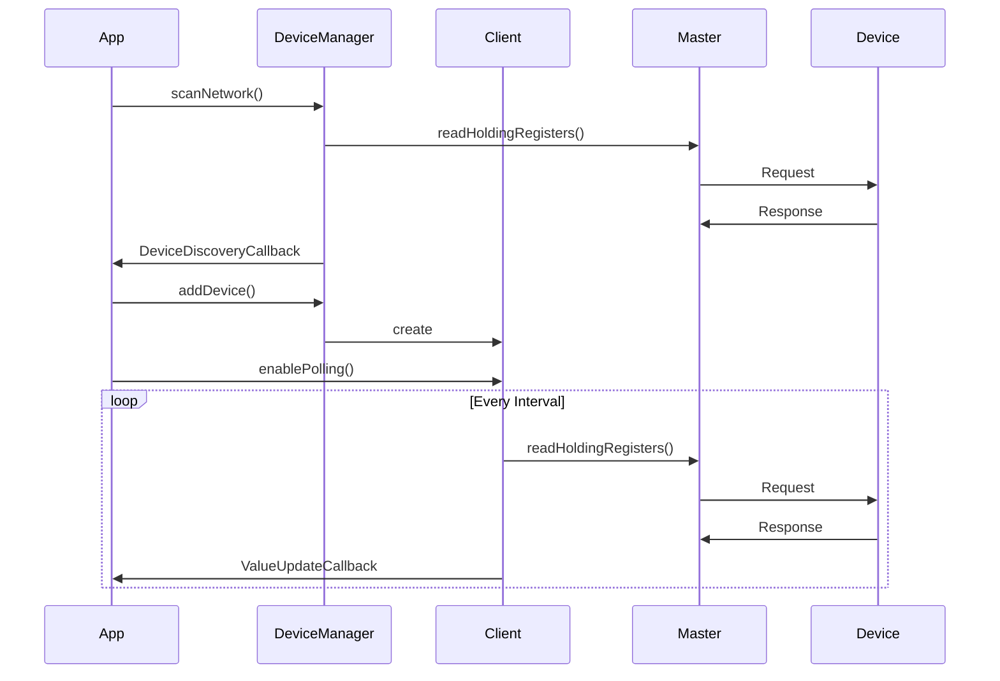

# Device Management Guide

## Overview

This guide demonstrates how to manage multiple Modbus devices using the ModbusDeviceManager and ModbusClient classes.

## Architecture



## Network Scanning

```cpp
// Create device manager
ModbusDeviceManager deviceManager(master);

// Scan for devices
deviceManager.scanNetwork(1, 10, [](uint8_t address, bool present) {
    if (present) {
        ESP_LOGI(TAG, "Found Modbus device at address %d", address);
    }
});
```

## Device Management

### Adding Devices

```cpp
// Add known devices
auto device1 = deviceManager.addDevice(1, "MPPT Controller");
auto device2 = deviceManager.addDevice(2, "Battery Monitor");

// Configure device-specific settings
if (device1) {
    device1->setMaxCacheAge(5000);  // 5 second cache
}
```

### Value Caching

```cpp
// Read with caching
device1->readHoldingRegister(0x0100, [](const ModbusValue& value) {
    if (value.valid) {
        ESP_LOGI(TAG, "Register 0x%04X = %d (age: %dms)", 
                 value.address, value.value,
                 (xTaskGetTickCount() - value.timestamp) * portTICK_PERIOD_MS);
    }
});
```

### Automatic Polling

```cpp
// Configure polling
device1->enablePolling(0x0100, 1000, [](const ModbusValue& value) {
    if (value.valid) {
        ESP_LOGI(TAG, "Poll update: Register 0x%04X = %d", 
                 value.address, value.value);
    }
});

// Change polling interval
device1->setPollInterval(0x0100, 2000);  // Change to 2 seconds

// Disable polling
device1->disablePolling(0x0100);
```

## Batch Operations

### Reading Multiple Registers

```cpp
device1->readMultipleHoldingRegisters(0x0100, 10, 
    [](const std::vector<ModbusValue>& values) {
        ESP_LOGI(TAG, "Read %d registers:", values.size());
        for (const auto& value : values) {
            if (value.valid) {
                ESP_LOGI(TAG, "  Register 0x%04X = %d", 
                         value.address, value.value);
            }
        }
    });
```

### Writing Multiple Registers

```cpp
std::vector<uint16_t> values = {1, 2, 3, 4, 5};
device1->writeMultipleHoldingRegisters(0x0100, values,
    [](bool success) {
        if (success) {
            ESP_LOGI(TAG, "Batch write successful");
        } else {
            ESP_LOGE(TAG, "Batch write failed");
        }
    });
```

## Network Management

### Statistics and Diagnostics

```cpp
// Get network statistics
const auto& stats = deviceManager.getNetworkStatistics();
ESP_LOGI(TAG, "Network Statistics:");
ESP_LOGI(TAG, "  Connected devices: %d", deviceManager.getDeviceCount());
ESP_LOGI(TAG, "  Successful transactions: %d", stats.successfulTransactions);
ESP_LOGI(TAG, "  Failed transactions: %d", stats.failedTransactions);
ESP_LOGI(TAG, "  Retries: %d", stats.retries);
ESP_LOGI(TAG, "  Timeouts: %d", stats.timeouts);

// Reset statistics
deviceManager.resetNetworkStatistics();
```

### Device Status

```cpp
// Check device connection status
for (const auto& device : deviceManager.getAllDevices()) {
    ESP_LOGI(TAG, "Device %s (addr: %d): %s",
             device->getName().c_str(),
             device->getSlaveAddress(),
             device->isConnected() ? "Connected" : "Disconnected");
}
```

### Network Cleanup

```cpp
// Remove a specific device
deviceManager.removeDevice(1);

// Disconnect all devices
deviceManager.disconnectAll();
```