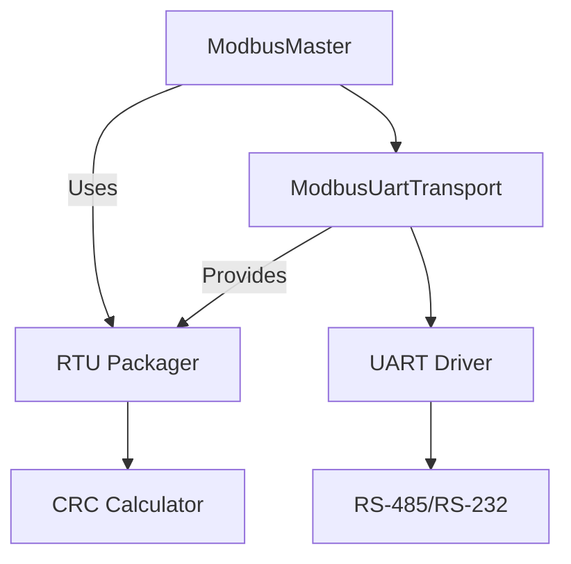
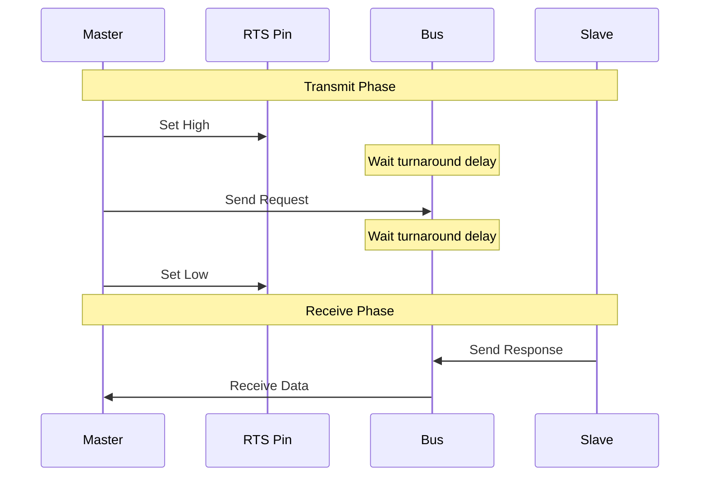
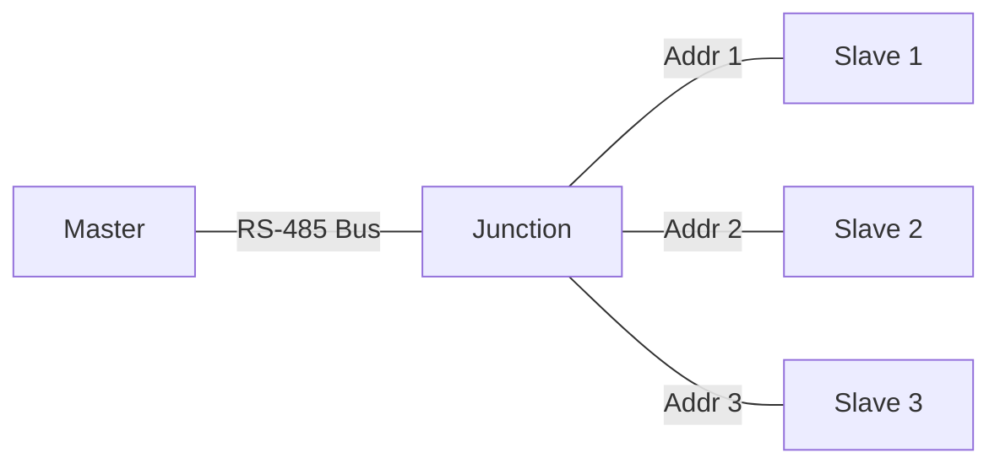

# RTU Mode Configuration

This guide covers RTU-specific configuration and usage of the Speed Framework Modbus library.

## RTU Architecture



## RTU Transport Configuration

### Basic Setup

```cpp
// Create RTU transport with default settings
UartConfig uartConfig;
uartConfig.baudRate = 9600;
uartConfig.dataBits = 8;
uartConfig.parity = UART_PARITY_NONE;
uartConfig.stopBits = 1;

auto transport = std::make_shared<ModbusUartTransport>(UART_NUM_1, uartConfig);

// Configure RS-485 mode if needed
Rs485Config rs485Config;
rs485Config.enabled = true;
rs485Config.rtsPin = GPIO_NUM_22;
rs485Config.rtsInvert = false;
transport->setRs485Config(rs485Config);
```

### Frame Timing Configuration

RTU mode requires precise timing between frames:

```cpp
ModbusRtuConfig rtuConfig;
rtuConfig.interFrameDelay = 4;    // Characters worth of delay between frames
rtuConfig.interCharTimeout = 2;    // Characters worth of timeout between bytes
rtuConfig.turnaroundDelay = 10;    // ms to wait after transmitting

transport->setRtuConfig(rtuConfig);
```

## RTU-Specific Features

### RS-485 Flow Control



### Frame Format


### CRC Calculation

RTU mode uses CRC-16 (Modbus) for error checking:

```cpp
// CRC is automatically handled by the transport layer
// but can be manually calculated if needed
uint16_t crc = transport->calculateCrc(data, length);
```

## Multiple Device Support

RTU allows multiple devices on the same bus, identified by their addresses:

```cpp
// Create single transport for the bus
auto transport = std::make_shared<ModbusUartTransport>(UART_NUM_1, uartConfig);
auto master = std::make_shared<ModbusMaster>(transport, config);
auto deviceManager = std::make_shared<ModbusDeviceManager>(master);

// Add multiple devices with different addresses
auto device1 = deviceManager->addDevice(1, "RTU Device 1");
auto device2 = deviceManager->addDevice(2, "RTU Device 2");
auto device3 = deviceManager->addDevice(3, "RTU Device 3");
```

### Network Topology



## Error Handling

RTU-specific error handling:

```cpp
transport->onError([](ModbusRtuError error) {
    switch (error) {
        case ModbusRtuError::CrcError:
            ESP_LOGE(TAG, "CRC check failed");
            break;
        case ModbusRtuError::FrameTimeout:
            ESP_LOGE(TAG, "Timeout waiting for complete frame");
            break;
        case ModbusRtuError::InvalidResponse:
            ESP_LOGE(TAG, "Invalid response format");
            break;
    }
});
```

## Performance Considerations

1. **Baud Rate Selection**: Higher baud rates increase throughput but may decrease reliability:
```cpp
uartConfig.baudRate = 19200;  // Balance between speed and reliability
```

2. **Buffer Sizes**: Adjust based on your message sizes:
```cpp
uartConfig.rxBufferSize = 256;
uartConfig.txBufferSize = 256;
```

3. **Timing Parameters**: Critical for reliable operation:
```cpp
// For 19200 baud:
rtuConfig.interFrameDelay = 2;    // 2 character times
rtuConfig.interCharTimeout = 1;    // 1 character time
rtuConfig.turnaroundDelay = 5;    // 5ms for RS-485 direction change
```

## Example: Multi-Device RTU Setup

```cpp
class RtuModbusExample {
public:
    void setup() {
        // Configure UART
        UartConfig uartConfig;
        uartConfig.baudRate = 19200;
        uartConfig.dataBits = 8;
        uartConfig.parity = UART_PARITY_NONE;
        uartConfig.stopBits = 1;
        
        // Configure RS-485
        Rs485Config rs485Config;
        rs485Config.enabled = true;
        rs485Config.rtsPin = GPIO_NUM_22;
        
        // Create transport
        auto transport = std::make_shared<ModbusUartTransport>(UART_NUM_1, uartConfig);
        transport->setRs485Config(rs485Config);
        
        // Configure RTU timing
        ModbusRtuConfig rtuConfig;
        rtuConfig.interFrameDelay = 2;
        rtuConfig.interCharTimeout = 1;
        rtuConfig.turnaroundDelay = 5;
        transport->setRtuConfig(rtuConfig);
        
        // Create master and device manager
        auto master = std::make_shared<ModbusMaster>(transport, config);
        auto manager = std::make_shared<ModbusDeviceManager>(master);
        
        // Add devices with different addresses
        std::vector<uint8_t> deviceAddresses = {1, 2, 3};
        
        for (auto addr : deviceAddresses) {
            auto device = manager->addDevice(addr, "RTU Device " + std::to_string(addr));
            
            // Configure device
            device->setMaxCacheAge(1000);
            device->enablePolling(0x0100, 1000, [addr](const ModbusValue& value) {
                if (value.valid) {
                    ESP_LOGI(TAG, "Device %d value: %d", addr, value.value);
                }
            });
            
            _devices.push_back(device);
        }
    }

private:
    ModbusConfig config;
    std::vector<std::shared_ptr<ModbusDevice>> _devices;
};
```