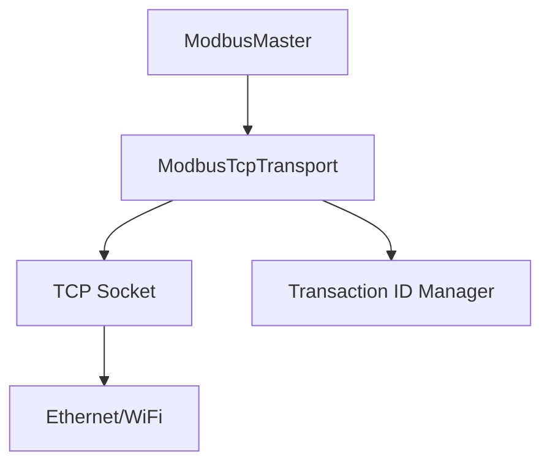
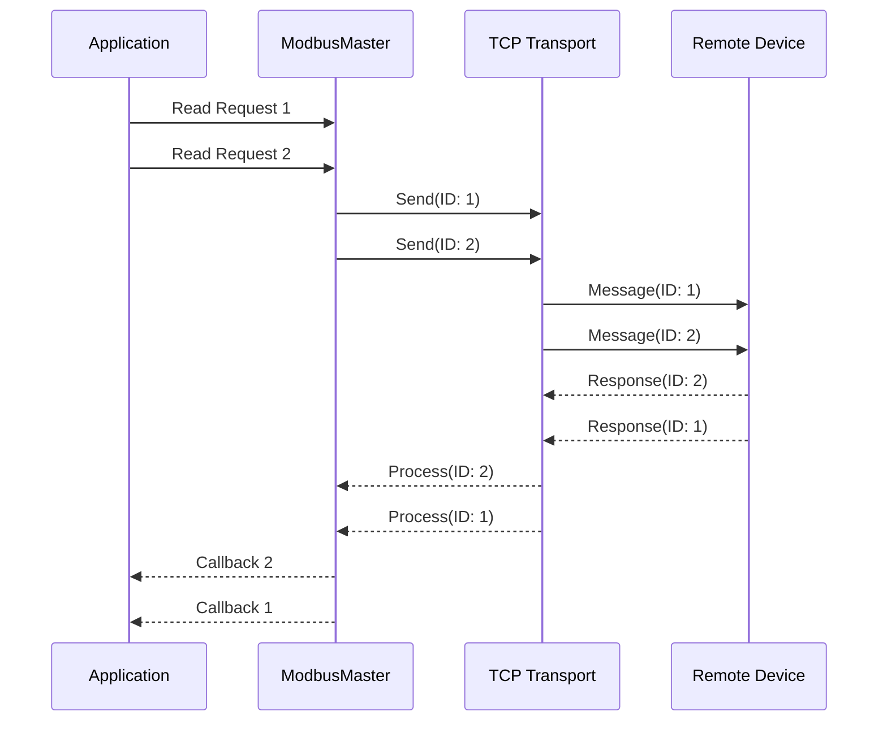
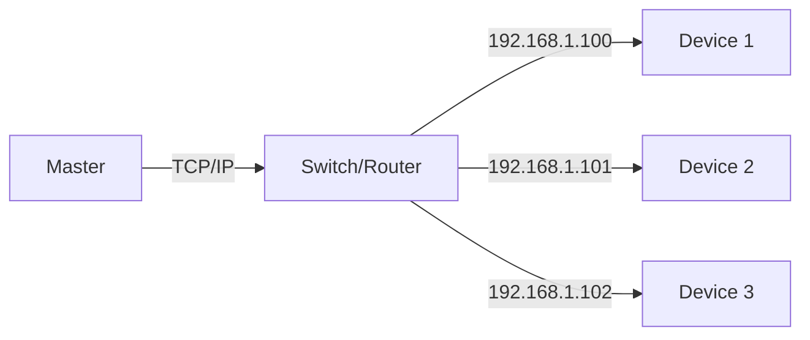

# TCP Mode Configuration

This guide covers TCP-specific configuration and usage of the Speed Framework Modbus library.

## TCP Architecture



## TCP Transport Configuration

### Basic Setup

```cpp
// Create TCP transport with default settings
auto transport = std::make_shared<ModbusTcpTransport>("192.168.1.100", 502);

// Create TCP transport with custom settings
ModbusTcpConfig tcpConfig;
tcpConfig.connectionTimeout = 5000;  // 5 seconds
tcpConfig.keepAlive = true;
tcpConfig.keepAliveIdle = 5;        // Start keepalive after 5 seconds
tcpConfig.keepAliveInterval = 2;     // 2 second interval
tcpConfig.keepAliveCount = 3;        // 3 retries

auto transport = std::make_shared<ModbusTcpTransport>("192.168.1.100", 502, tcpConfig);
```

### Connection Management

```cpp
// Manual connection control
transport->disconnect();
bool connected = transport->connect();

// Check connection status
if (transport->isConnected()) {
    // Perform operations
}

// Set connection callback
transport->onConnectionChange([](bool connected) {
    if (connected) {
        ESP_LOGI(TAG, "TCP connection established");
    } else {
        ESP_LOGI(TAG, "TCP connection lost");
    }
});
```

## TCP-Specific Features

### Transaction ID Management

TCP Modbus includes a transaction ID in each message to handle multiple concurrent requests:



### Multiple Device Support

TCP mode allows connecting to multiple devices on different IP addresses:

```cpp
// Create transports for different devices
auto transport1 = std::make_shared<ModbusTcpTransport>("192.168.1.100", 502);
auto transport2 = std::make_shared<ModbusTcpTransport>("192.168.1.101", 502);

// Create masters
auto master1 = std::make_shared<ModbusMaster>(transport1, config);
auto master2 = std::make_shared<ModbusMaster>(transport2, config);

// Create device managers
auto deviceManager1 = std::make_shared<ModbusDeviceManager>(master1);
auto deviceManager2 = std::make_shared<ModbusDeviceManager>(master2);
```

### Error Handling

TCP-specific error handling:

```cpp
transport->onError([](ModbusTcpError error) {
    switch (error) {
        case ModbusTcpError::ConnectionFailed:
            ESP_LOGE(TAG, "Failed to connect to server");
            break;
        case ModbusTcpError::ConnectionLost:
            ESP_LOGE(TAG, "Connection lost during operation");
            break;
        case ModbusTcpError::InvalidTransactionId:
            ESP_LOGE(TAG, "Received response with invalid transaction ID");
            break;
    }
});
```

## Network Topology



## Performance Considerations

1. **Connection Pooling**: The TCP transport maintains a connection pool to reduce connection overhead.

2. **Keep-Alive Settings**: Proper keep-alive configuration helps detect connection issues early:
```cpp
tcpConfig.keepAlive = true;
tcpConfig.keepAliveIdle = 5;     // Start after 5s of idle
tcpConfig.keepAliveInterval = 2;  // Check every 2s
tcpConfig.keepAliveCount = 3;     // Allow 3 retries
```

3. **Transaction Queue Size**: Adjust based on your needs:
```cpp
config.queueSize = 32;  // Increase for high-throughput applications
```

## Example: Multi-Device TCP Setup

```cpp
class TcpModbusExample {
public:
    void setup() {
        // Configure multiple TCP devices
        std::vector<std::string> deviceIps = {
            "192.168.1.100",
            "192.168.1.101",
            "192.168.1.102"
        };

        for (const auto& ip : deviceIps) {
            auto transport = std::make_shared<ModbusTcpTransport>(ip, 502);
            auto master = std::make_shared<ModbusMaster>(transport, config);
            auto manager = std::make_shared<ModbusDeviceManager>(master);
            
            // Add devices for this connection
            auto device = manager->addDevice(1, "TCP Device " + ip);
            
            // Configure device
            device->setMaxCacheAge(1000);
            device->enablePolling(0x0100, 1000, [ip](const ModbusValue& value) {
                if (value.valid) {
                    ESP_LOGI(TAG, "Device %s value: %d", ip.c_str(), value.value);
                }
            });
            
            _devices.push_back(device);
        }
    }

private:
    ModbusConfig config;
    std::vector<std::shared_ptr<ModbusDevice>> _devices;
};
```